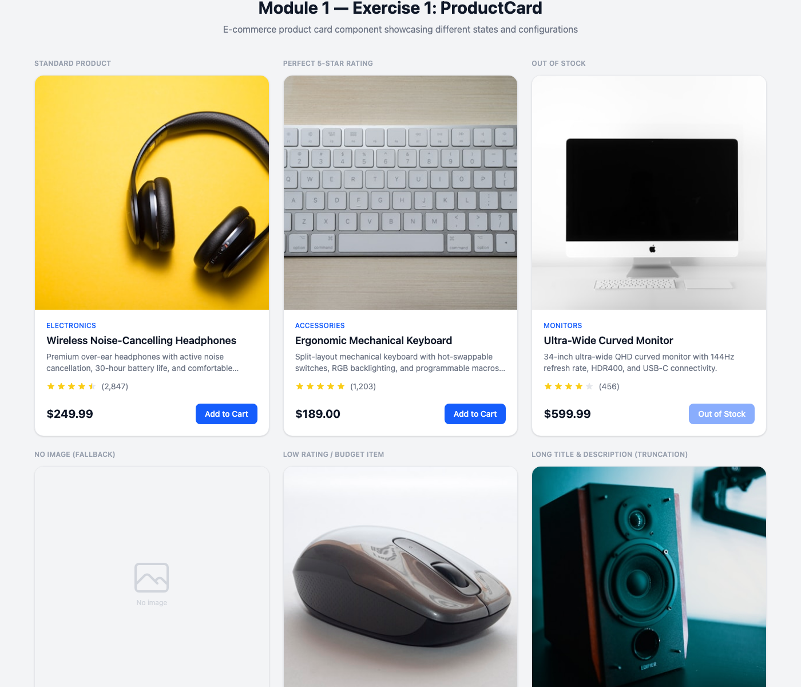
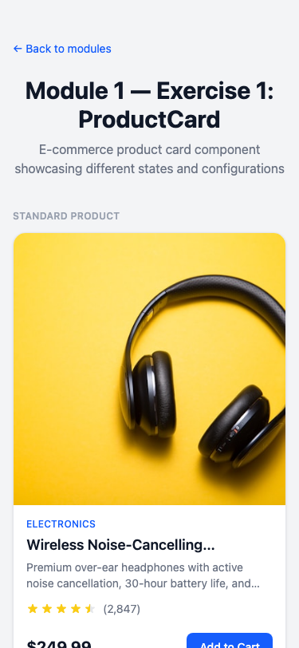

# Exercise 1: Build a Product Card Component

## Overview

A reusable `ProductCard` component for an e-commerce application, built with React 19, TypeScript 5.6 (strict mode), and Tailwind CSS v4. The component displays product information including image, title, description, price, star rating, and an "Add to Cart" button.

## Setup Instructions

```bash
# Install dependencies
npm install

# Start development server
npm run dev

# Navigate to the exercise
# http://localhost:5173/module-1/exercise-1
```

## What Was Implemented

### Components Created

| File | Description |
|------|-------------|
| `src/modules/module-1/exercise-1/types/product.ts` | `Product` and `ProductCardProps` TypeScript interfaces |
| `src/modules/module-1/exercise-1/lib/format.ts` | `formatPrice()` utility using `Intl.NumberFormat` |
| `src/modules/module-1/exercise-1/components/ui/ProductImage.tsx` | Product image with SVG placeholder fallback on error |
| `src/modules/module-1/exercise-1/components/ui/RatingStars.tsx` | Star rating display with full, half, and empty stars |
| `src/modules/module-1/exercise-1/components/features/ProductCard.tsx` | Main card component composing all UI primitives |
| `src/modules/module-1/exercise-1/components/features/index.ts` | Barrel export |
| `src/pages/Module1Exercise1.tsx` | Demo page with 6 sample products in a responsive grid |

### Key Features

- **Product Image with Fallback**: Uses `useState` + `useEffect` to detect broken images and show an SVG placeholder icon
- **Star Rating (RatingStars)**: Supports full stars, half stars (via SVG linear gradient), and empty stars. Renders 0-5 scale with review count
- **Price Formatting**: Locale-aware currency formatting via `Intl.NumberFormat`
- **Responsive Grid**: `grid-cols-1` (mobile) -> `grid-cols-2` (tablet) -> `grid-cols-3` (desktop)
- **Hover Animations**: Card lifts on hover (`hover:-translate-y-1 hover:shadow-lg`), image zooms (`group-hover:scale-105`)
- **Out of Stock State**: Disabled "Out of Stock" button with `disabled:opacity-50`
- **Text Truncation**: `line-clamp-1` on title, `line-clamp-2` on description for consistent card heights
- **Category Badge**: Uppercase colored label above the product title

### Accessibility

- Semantic HTML: `<article>` wrapper with `aria-label` per card
- Star rating uses `role="img"` with descriptive `aria-label` ("Rating: 4.5 out of 5 stars, 2,847 reviews")
- "Add to Cart" button has `aria-label` with product name context
- Out-of-stock button has descriptive `aria-label` ("... is out of stock")
- Focus-visible outlines on all interactive elements
- Proper `alt` text on all product images

### Demo Page: 6 Product Variations

| Product | What It Tests |
|---------|---------------|
| Wireless Headphones | Standard product, 4.5 stars (half-star rendering) |
| Mechanical Keyboard | Perfect 5-star rating, all stars filled |
| Curved Monitor | **Out of Stock** - disabled button state |
| USB-C Hub Adapter | **No image** - SVG placeholder fallback |
| Basic Wired Mouse | Low rating (2.5 stars), budget price ($7.99) |
| Studio Speakers | Long title + description truncation (`line-clamp`) |

## Screenshots

### Desktop View (3-column grid, 1400px)

> Run `npm run dev`, navigate to `http://localhost:5173/module-1/exercise-1`



All 6 product cards in a 3-column responsive grid. Cards show product images, category badges, titles, truncated descriptions, star ratings with review counts, prices, and action buttons.

### Mobile View (single column, 375px)



Cards stack in a single column on mobile. Full-width layout with consistent spacing.

### Key States


- "Out of Stock" button is grayed out and disabled
- "No Image" card shows the SVG placeholder icon
- Half-star rendering visible on 4.5 and 2.5 rated products
- Long titles and descriptions are truncated with ellipsis

> **Note**: To capture these screenshots, open the app in Chrome, navigate to the exercise page, and use the browser's built-in screenshot tools or DevTools device toolbar for mobile views.

## AI Prompts Used

Below are the prompts used in Cursor AI to generate and refine this component:

### Prompt 1: Initial Component Generation

```
Create a ProductCard component for an e-commerce application. Include product
image, title, description, price, star rating, and an "Add to Cart" button.
Use TypeScript for props and Tailwind CSS for styling. Make it responsive
with smooth hover effects and animations. Include accessibility features.
```

### Prompt 2: Star Rating Component

```
Create a RatingStars component that displays 1-5 stars with support for
half-star ratings. Use inline SVGs (no icon library). Each star should be
yellow when filled, gray when empty, and use an SVG gradient for half stars.
Include an optional review count display. Add role="img" and aria-label
for screen reader accessibility.
```

### Prompt 3: Product Image with Fallback

```
Create a ProductImage component that displays a product photo with a graceful
fallback when the image URL is missing or fails to load. Use useState for
error tracking and useEffect to reset when the src prop changes. Show an
SVG placeholder icon when no image is available. Follow the same pattern as
the Avatar component from the instructor demo.
```

### Prompt 4: Demo Page with Sample Data

```
Create a demo page that showcases the ProductCard component with sample data.
Include 6 different products that test edge cases: standard product, perfect
5-star rating, out of stock (disabled button), no image (fallback), low
rating with budget price, and long title/description (truncation). Use a
responsive grid layout: 1 column on mobile, 2 on tablet, 3 on desktop.
```

### Prompt 5: Refinements

```
Review the ProductCard for accessibility gaps. Ensure every interactive
element has an aria-label, the star rating is announced properly by screen
readers, and the out-of-stock state is communicated to assistive technology.
Add focus-visible outlines matching the project's existing Button component
pattern.
```

## Acceptance Criteria Checklist

- [x] Component displays all product information (image, title, description, price, rating, button)
- [x] Responsive design (1 col mobile, 2 col tablet, 3 col desktop)
- [x] Hover effects on card (lift + shadow) and button (color transition)
- [x] Proper TypeScript typing (Product interface, ProductCardProps, strict mode)
- [x] Accessibility attributes present (aria-label, role, semantic HTML, focus-visible)
- [x] Image fallback when URL is missing or broken
- [x] Out of stock disabled state
- [x] Star rating with half-star support
- [x] Text truncation for long content
- [x] Price formatting with currency symbol
