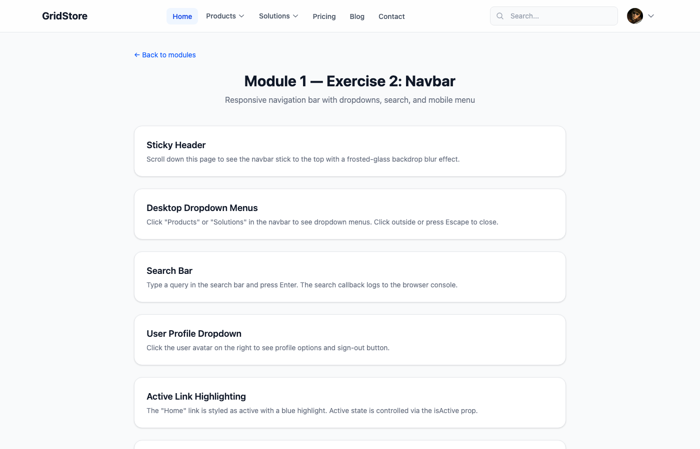
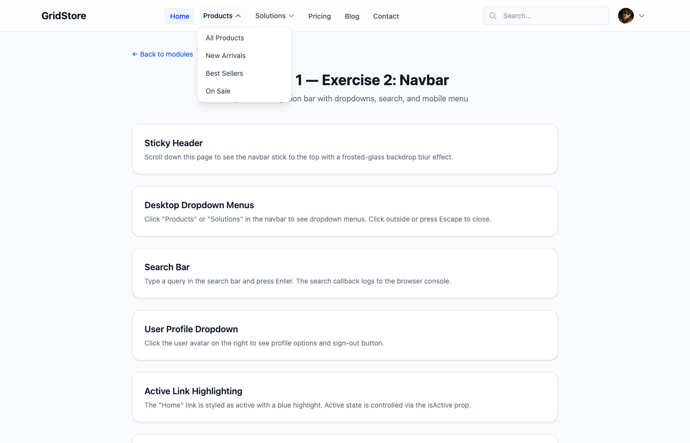
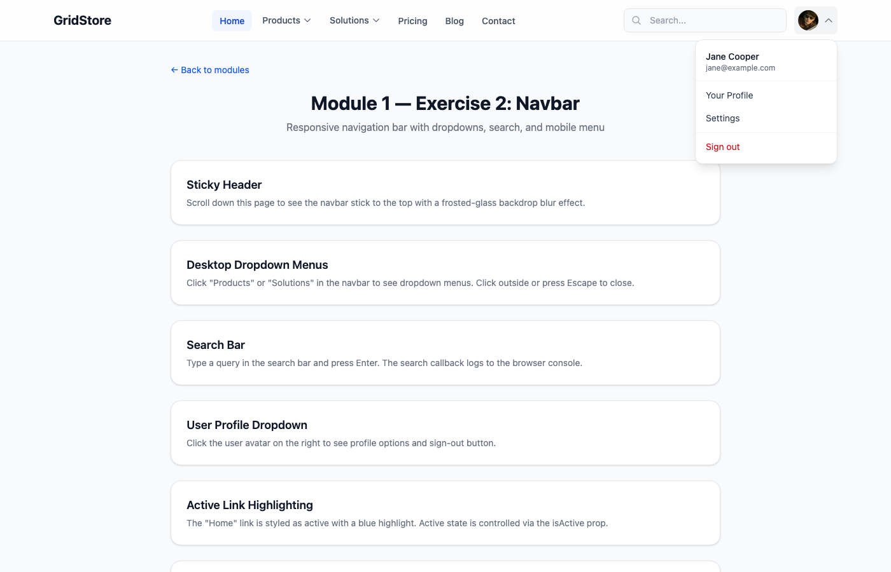
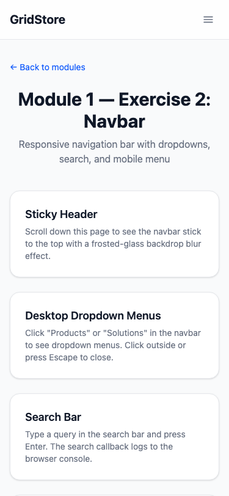
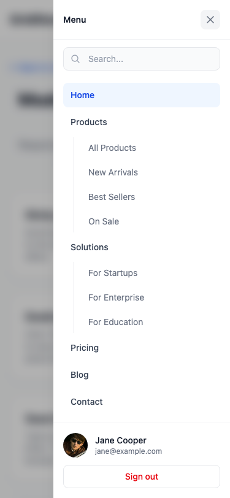

# Exercise 2: Create a Navigation Bar Component

## Overview

A responsive navigation bar component built with React 19, TypeScript 5.6 (strict mode), and Tailwind CSS v4. Features a sticky header, dropdown menus, search bar, user profile dropdown, mobile hamburger slide-in menu, and active link highlighting.

## Setup Instructions

```bash
npm install
npm run dev
# Navigate to http://localhost:5173/module-1/exercise-2
```

## What Was Implemented

### Components Created

| File | Description |
|------|-------------|
| `types/navigation.ts` | `NavItem`, `UserInfo`, and `NavbarProps` TypeScript interfaces |
| `hooks/useDropdown.ts` | Generic hook for dropdown state, click-outside closing, and Escape key |
| `hooks/useMobileMenu.ts` | Hook for mobile menu state with body scroll locking |
| `components/ui/SearchBar.tsx` | Search input with magnifying glass icon and form submission |
| `components/ui/UserDropdown.tsx` | Avatar button with profile menu (Profile, Settings, Sign out) |
| `components/ui/MobileMenu.tsx` | Full-height slide-in panel with backdrop, search, nav items, and user section |
| `components/features/Navbar.tsx` | Main navbar composing all sub-components with desktop dropdown nav items |
| `components/features/index.ts` | Barrel export |
| `src/pages/Module1Exercise2.tsx` | Demo page with feature cards explaining each navbar capability |

### Key Features

- **Sticky Header**: `sticky top-0` with `bg-white/80 backdrop-blur-md` frosted-glass effect
- **Desktop Dropdown Menus**: "Products" and "Solutions" have dropdown sub-menus with animated chevron rotation
- **Click-Outside Dismiss**: Dropdowns close when clicking anywhere outside, via `useDropdown` hook with `useRef` + `mousedown` listener
- **Escape Key Dismiss**: All dropdowns respond to the Escape key
- **Search Bar**: Accessible search form with `role="search"`, label for screen readers, and submit-on-Enter
- **User Profile Dropdown**: Avatar with initials fallback, name/email header, menu items, red "Sign out" button
- **Active Link Highlighting**: "Home" link styled with `bg-blue-50 text-blue-700` via `isActive` prop
- **Mobile Hamburger Menu**: Appears below `lg:` breakpoint (1024px). Opens a slide-in panel from the right with backdrop blur overlay
- **Body Scroll Lock**: `useMobileMenu` hook sets `document.body.style.overflow = "hidden"` while the mobile menu is open
- **Nested Nav Items**: Mobile menu renders sub-items indented with a left border line

### Accessibility

- Semantic `<header>` and `<nav>` elements with `aria-label` for main and mobile navigation
- All dropdown triggers use `aria-expanded` and `aria-haspopup="true"`
- Menu panels use `role="menu"` and items use `role="menuitem"`
- Search form uses `role="search"` with a visually hidden `<label>`
- Focus-visible outlines on all interactive elements
- Hamburger button toggles `aria-expanded` state
- Close button on mobile menu with `aria-label="Close menu"`

## Screenshots

### Desktop View (1400px) — Full Navbar



Sticky navbar with logo, nav links (Home active), dropdown items, search bar, and user avatar.

### Products Dropdown Open



"Products" dropdown showing 4 sub-items: All Products, New Arrivals, Best Sellers, On Sale.

### User Profile Dropdown



User avatar dropdown with name/email, profile links, and red Sign out button.

### Mobile View (375px) — Hamburger Icon



Logo and hamburger icon on mobile. All nav links hidden behind the menu.

### Mobile Slide-In Menu



Full slide-in panel with search, active Home link, nested sub-items (Products, Solutions), and user section with Sign out at the bottom.

## AI Prompts Used

### Prompt 1: Initial Navbar Generation

```
Create a responsive navigation bar component with logo, menu items, search bar,
and user profile dropdown. Include mobile hamburger menu. Use TypeScript and
Tailwind CSS. Make it sticky on scroll with smooth animations.
```

### Prompt 2: Dropdown Hook with Click-Outside

```
Create a reusable useDropdown hook that manages open/close state for dropdown
menus. Include click-outside detection using useRef and mousedown event listener,
Escape key handling, and a generic type parameter so the ref can attach to any
HTML element type. Return isOpen, toggle, close, and ref.
```

### Prompt 3: Mobile Menu with Slide-In Panel

```
Create a MobileMenu component that slides in from the right side of the screen
with a semi-transparent backdrop. Include a search bar at the top, all nav items
with nested sub-items shown inline, and a user info section with sign-out button
at the bottom. Lock body scroll while the menu is open.
```

### Prompt 4: User Profile Dropdown

```
Create a UserDropdown component showing the user avatar (with initials fallback
when no image), a chevron indicator, and a dropdown panel with user name/email
header, profile links, and a sign-out button styled in red. Use the useDropdown
hook for state management and click-outside dismissal.
```

### Prompt 5: Active Link Highlighting and Nav Items

```
Add active link highlighting to the navbar. The currently active nav item should
have a blue background tint. Support dropdown nav items that have children array
for sub-menus with animated chevron rotation. Each nav item should accept an
isActive boolean prop.
```

### Prompt 6: Accessibility Review

```
Review the Navbar component for accessibility. Ensure dropdown triggers have
aria-expanded and aria-haspopup, menu panels use role="menu", the search form
has role="search" with a screen-reader label, and the mobile hamburger button
communicates its state to assistive technology.
```

## Acceptance Criteria Checklist

- [x] Responsive navigation bar with logo, menu items, search, and user profile
- [x] Desktop dropdown menus with click-outside and Escape key dismissal
- [x] Mobile hamburger menu with slide-in panel
- [x] Sticky header with frosted-glass backdrop blur
- [x] Active link highlighting (Home link styled blue)
- [x] Search functionality placeholder with form submission
- [x] User profile dropdown with avatar, name, and sign-out
- [x] Proper TypeScript typing (NavItem, UserInfo, NavbarProps)
- [x] Accessibility attributes (aria-expanded, role="menu", aria-label, focus-visible)
- [x] Body scroll locked when mobile menu is open
- [x] Nested sub-items in both desktop dropdowns and mobile menu
