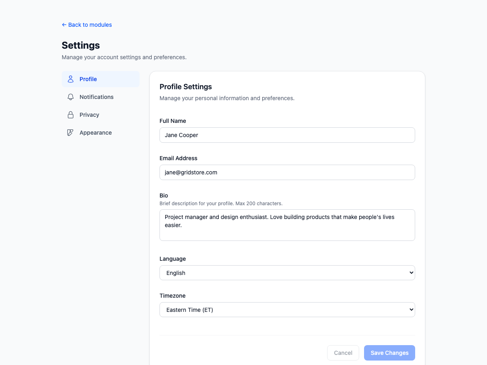
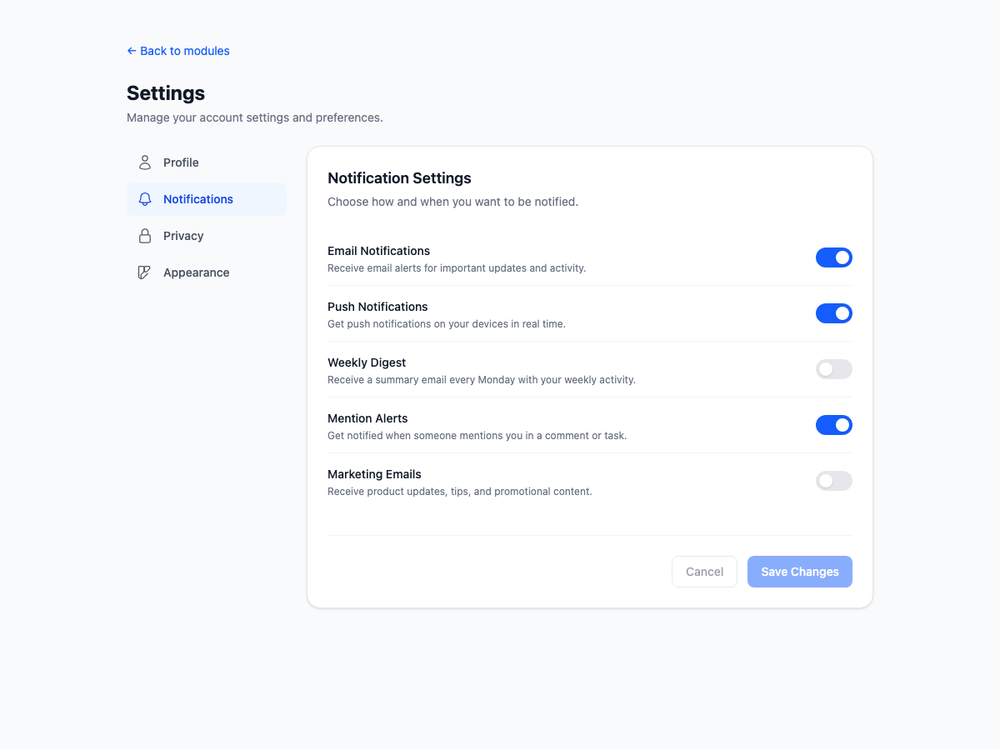
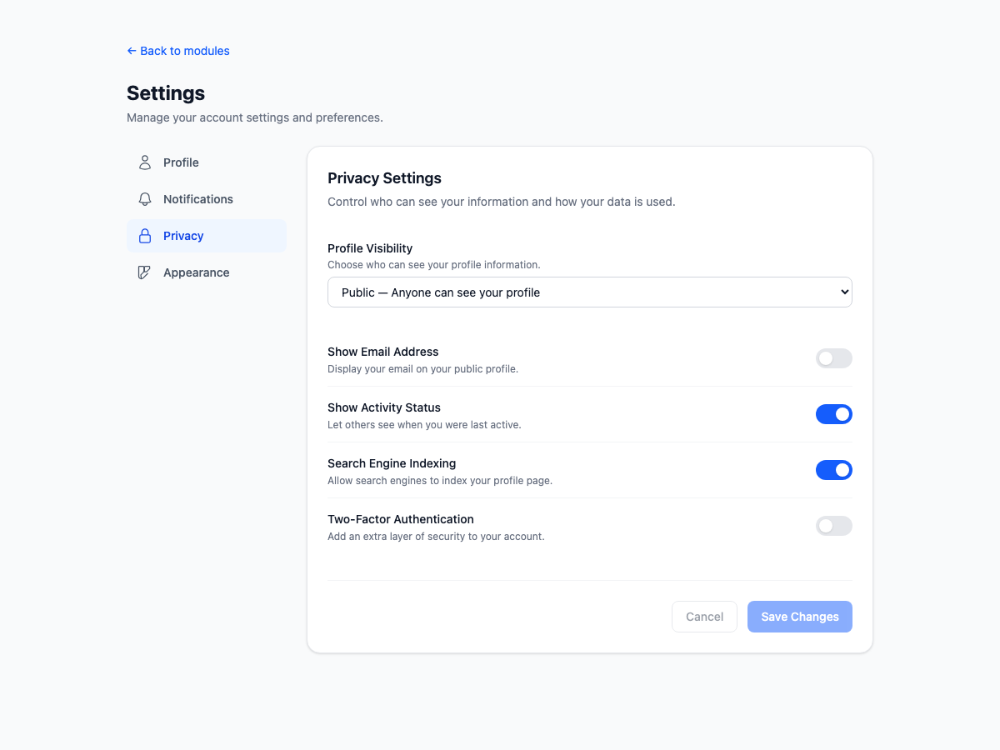
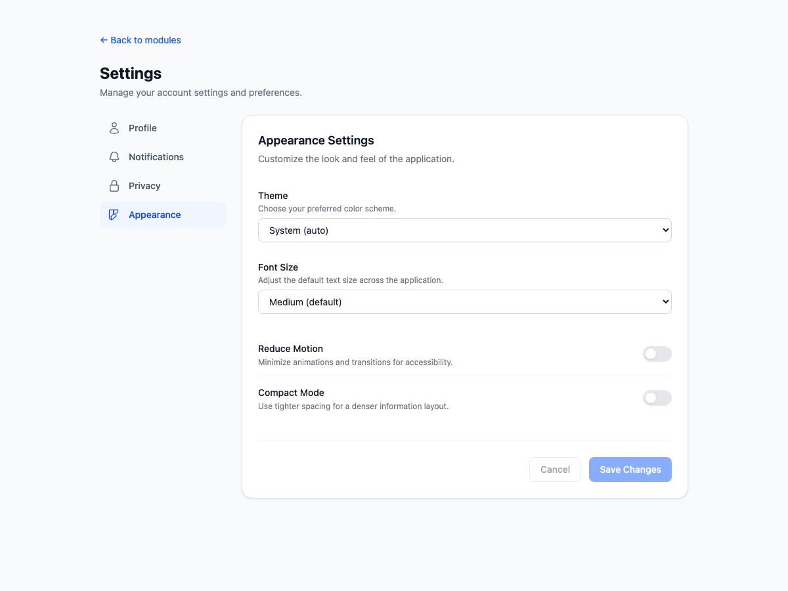
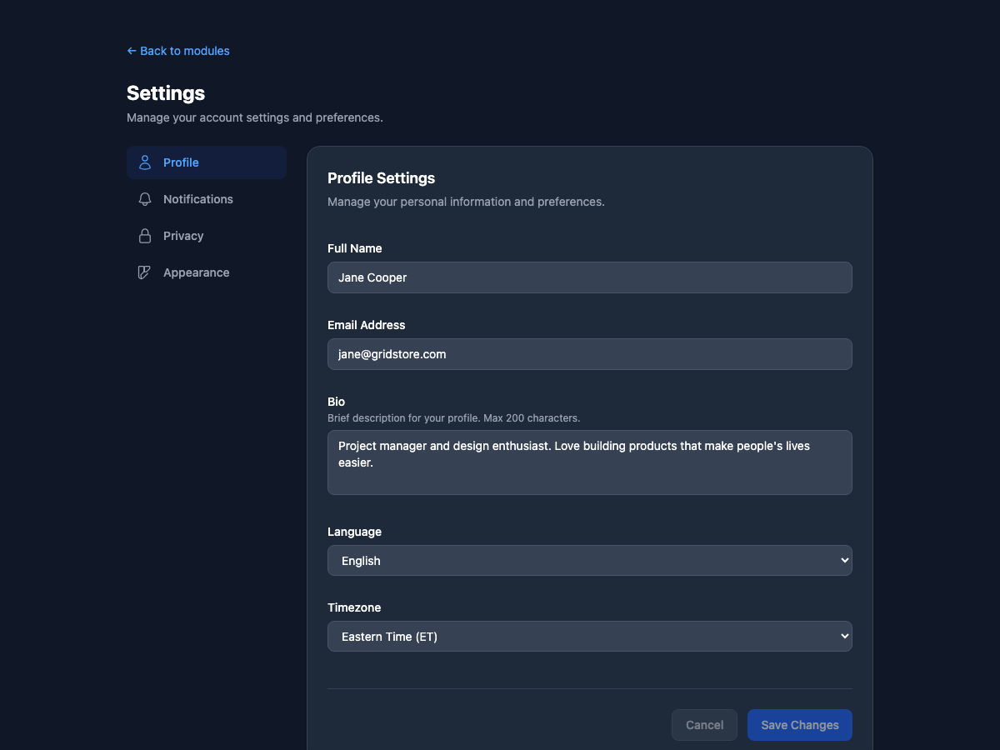
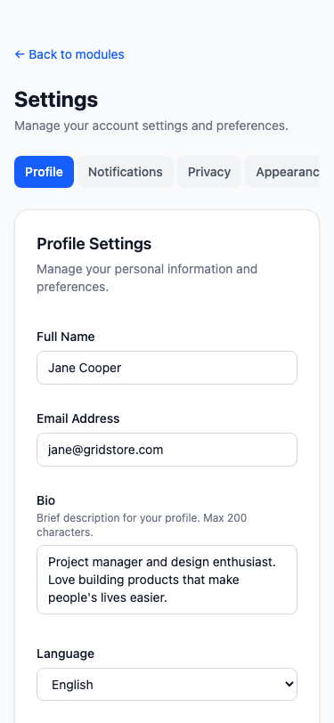

# Exercise 3: Build a Settings Panel

## Overview

A comprehensive settings panel with tabbed navigation, form inputs, toggle switches, dropdowns, and save/cancel actions. Built with React 19, TypeScript 5.6 (strict mode), and Tailwind CSS v4 with full dark mode support.

## Setup Instructions

```bash
npm install
npm run dev
# Navigate to http://localhost:5173/module-2/exercise-3
```

## What Was Implemented

### Components Created

| File | Description |
|------|-------------|
| `types/settings.ts` | `SettingsTab`, `ProfileSettings`, `NotificationSettings`, `PrivacySettings`, `AppearanceSettings`, `AllSettings` |
| `hooks/useSettingsForm.ts` | Form state management with dirty tracking, save simulation, cancel/reset |
| `components/ui/ToggleSwitch.tsx` | Accessible toggle switch with `role="switch"` and `aria-checked` |
| `components/ui/TextInput.tsx` | Text/email input and multiline textarea with labels |
| `components/ui/SelectInput.tsx` | Dropdown select with label and description |
| `components/ui/SettingsTabs.tsx` | Vertical tab nav (desktop) / horizontal scroll tabs (mobile) with icons |
| `components/features/ProfileTab.tsx` | Name, email, bio, language, timezone fields |
| `components/features/NotificationsTab.tsx` | 5 toggle switches for notification preferences |
| `components/features/PrivacyTab.tsx` | Visibility dropdown + 4 privacy toggles |
| `components/features/AppearanceTab.tsx` | Theme/font-size selects + reduced motion/compact mode toggles |
| `components/features/SettingsPanel.tsx` | Main composition: tabs + active panel + save/cancel bar |
| `components/features/index.ts` | Barrel export |

### Key Features

- **4 Tab Panels**: Profile, Notifications, Privacy, Appearance — each with distinct form controls
- **Tab Navigation**: Vertical sidebar with icons on desktop, horizontal scrolling pills on mobile
- **Toggle Switches**: Custom `role="switch"` buttons with smooth sliding animation
- **Form Inputs**: Text, email, textarea, and select dropdowns with consistent styling
- **Dirty State Tracking**: Save/Cancel buttons are disabled until changes are made
- **Save Simulation**: "Saving..." state with success message that auto-dismisses after 3 seconds
- **Cancel/Reset**: Reverts all changes back to last saved state
- **Dark Mode Support**: All components use `dark:` variants with `transition-colors`
- **Responsive Layout**: Side-by-side tabs + panel on desktop, stacked with horizontal tabs on mobile

### Accessibility

- `role="switch"` + `aria-checked` on toggle switches
- `role="tab"` + `aria-selected` on tab buttons
- `role="tabpanel"` + `aria-label` on each settings panel
- Proper `<label htmlFor>` on all form inputs
- `focus-visible` outlines on all interactive elements
- Disabled state styling on Save/Cancel when no changes

## Screenshots

### Profile Tab (Light Mode)


### Notifications Tab


### Privacy Tab


### Appearance Tab


### Profile Tab (Dark Mode)


### Mobile View


## AI Prompts Used

### Prompt 1: Initial Settings Panel

```
Create a settings panel component with tabs for Profile, Notifications, Privacy,
and Appearance. Include form inputs, toggle switches, dropdowns, and save buttons.
Use Tailwind CSS with dark mode support. Make it responsive and accessible.
```

### Prompt 2: Toggle Switch Component

```
Create a reusable ToggleSwitch component with role="switch" and aria-checked
for accessibility. Include a label, optional description text, and smooth
sliding animation. Support disabled state. Style with Tailwind CSS including
dark mode variants.
```

### Prompt 3: Form State Management Hook

```
Create a useSettingsForm hook that manages form state for a multi-tab settings
panel. Track dirty state by comparing current vs saved values. Include save
(with simulated async delay), cancel (revert to saved), and per-section update
functions. Use TypeScript generics for type-safe field updates.
```

### Prompt 4: Tab Navigation with Icons

```
Build a SettingsTabs component with vertical layout on desktop (sidebar with
icons and labels) and horizontal scrollable pills on mobile. Use role="tab"
and aria-selected for accessibility. Each tab has an SVG icon. Active tab
shows blue highlight with dark mode support.
```

### Prompt 5: Dark Mode Polish

```
Review all settings panel components for dark mode consistency. Ensure every
text, background, border, and form input has a dark: variant. Input fields
should have dark backgrounds with light text. Toggle switches should show
gray track in dark mode when off. Divider lines should use dark:divide-gray-700.
```

## Acceptance Criteria Checklist

- [x] Tab navigation between 4 settings sections
- [x] Profile form with text inputs, textarea, and dropdowns
- [x] Toggle switches for notification and privacy settings
- [x] Appearance settings with theme and font size selects
- [x] Form validation placeholders (dirty tracking, disabled buttons)
- [x] Save action with loading state and success message
- [x] Cancel action that reverts unsaved changes
- [x] Dark mode support on all components
- [x] Responsive layout (vertical tabs desktop, horizontal mobile)
- [x] Accessible form controls (labels, roles, aria attributes)
