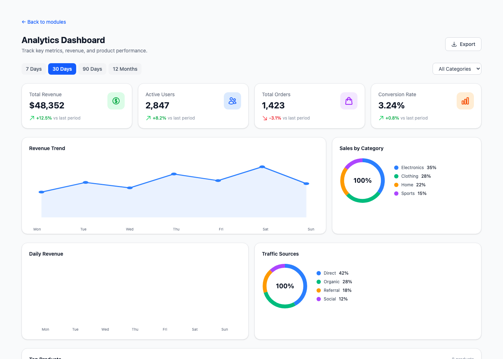
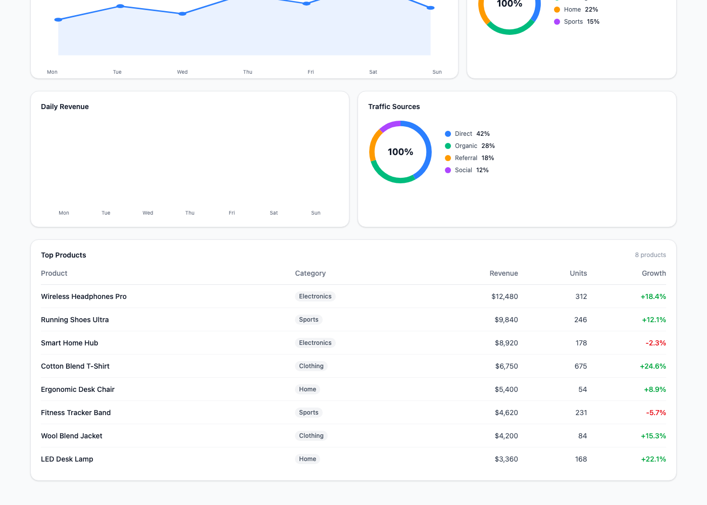
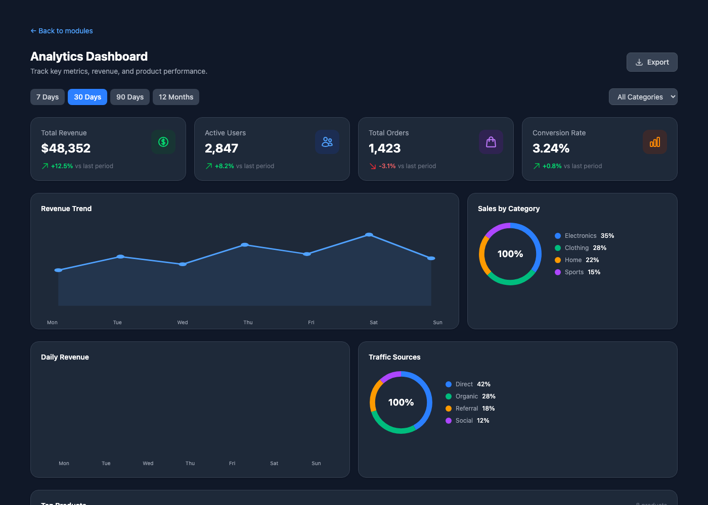
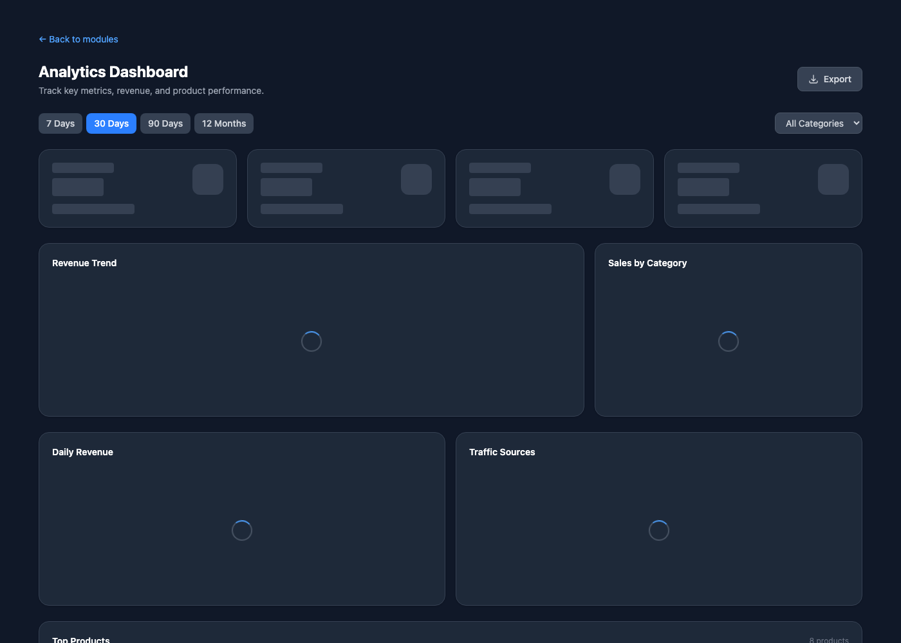
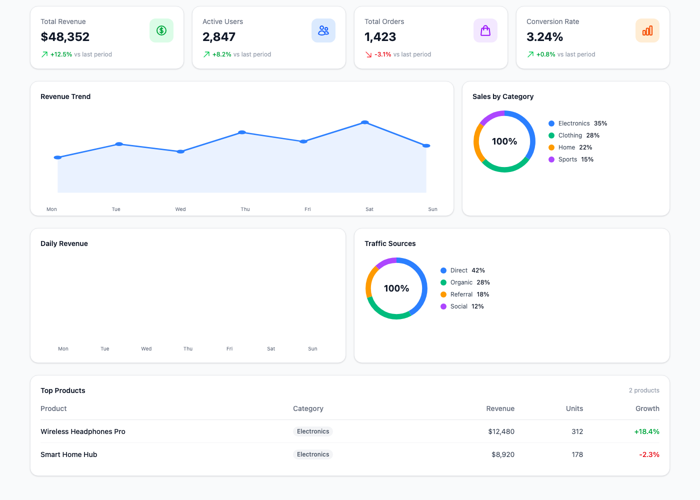
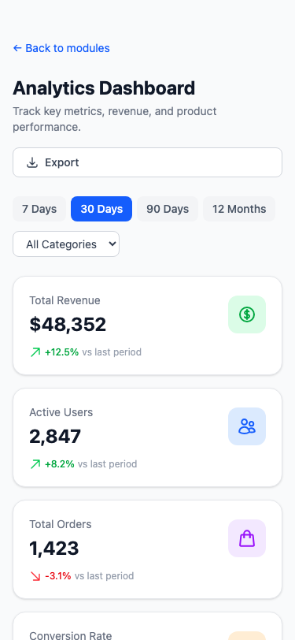

# Exercise 4: Create a Data Visualization Dashboard

## Overview

A data analytics dashboard with KPI cards, SVG chart visualizations (line, bar, donut), a filterable data table, date range selectors, category filters, and loading states. Built with React 19, TypeScript 5.6 (strict mode), and Tailwind CSS v4 with full dark mode support.

## Setup Instructions

```bash
npm install
npm run dev
# Navigate to http://localhost:5173/module-2/exercise-4
```

## What Was Implemented

### Components Created

| File | Description |
|------|-------------|
| `types/analytics.ts` | `KpiMetric`, `DateRange`, `Category`, `Filters`, `ChartData`, `TableRow` |
| `lib/data.ts` | Sample KPI metrics, chart datasets, table rows, `formatCurrency` utility |
| `hooks/useFilters.ts` | Filter state (date range + category) with simulated loading delay and `useMemo` filtered data |
| `components/ui/KpiCard.tsx` | KPI metric card with icon, value, trend arrow, and skeleton loading state |
| `components/ui/ChartPlaceholder.tsx` | SVG chart components: `LineChart`, `BarChart`, `DonutChart` with spinner loading |
| `components/ui/DataTable.tsx` | Sortable data table with category badges, growth colors, and skeleton loading |
| `components/ui/FilterBar.tsx` | Date range pill buttons + category dropdown select |
| `components/features/AnalyticsDashboard.tsx` | Main composition: header, filters, KPI grid, charts, data table |
| `components/features/index.ts` | Barrel export |

### Key Features

- **4 KPI Cards**: Revenue ($48,352), Active Users (2,847), Orders (1,423), Conversion Rate (3.24%) — each with colored icon and trend percentage
- **3 Chart Types**: Line chart (Revenue Trend), Bar chart (Daily Revenue), Donut chart (Sales by Category, Traffic Sources) — all pure SVG, no chart library
- **Data Table**: 8 products with category badges, formatted revenue, unit counts, and color-coded growth percentages
- **Date Range Filter**: 7 Days / 30 Days / 90 Days / 12 Months pill buttons
- **Category Filter**: Dropdown select that filters the data table (All / Electronics / Clothing / Home / Sports)
- **Loading States**: Skeleton placeholders on KPI cards, spinning loaders on charts, skeleton rows on table — triggered when changing filters
- **Dark Mode**: Full `dark:` variant support on all components
- **Responsive Grid**: KPI cards 1→2→4 columns, charts 1→2→3 columns, table scrolls horizontally on mobile
- **Export Button**: Placeholder action button in the header

### Chart Visualizations (Pure SVG)

- **Line Chart**: `<polyline>` with data points as `<circle>`, filled area below using `<polygon>`
- **Bar Chart**: `<div>` bars with percentage-based heights, colored with Tailwind classes
- **Donut Chart**: SVG `<circle>` elements with `stroke-dasharray` and `stroke-dashoffset` for segmented ring, centered total label

## Screenshots

### Desktop Light Mode — KPI Cards & Charts


### Data Table with Products


### Desktop Dark Mode


### Loading State (Skeleton + Spinners)


### Category Filter Applied (Electronics only)


### Mobile View


## AI Prompts Used

### Prompt 1: Initial Dashboard Layout

```
Create a data analytics dashboard with chart placeholders, KPI cards, and data
tables. Include filter controls and date range selectors. Use Tailwind CSS for
styling with a modern, professional design. Support dark mode.
```

### Prompt 2: SVG Chart Components

```
Create mock chart components using pure SVG (no chart library). Build three types:
a line chart with area fill and data points, a bar chart with percentage-based
heights, and a donut chart using stroke-dasharray on SVG circles with a centered
total label and color legend. Each chart should accept a data array and support
dark mode.
```

### Prompt 3: KPI Cards with Loading Skeleton

```
Create a KpiCard component that shows a metric label, large value, colored icon,
and trend arrow with percentage. Add a loading state that shows animated skeleton
placeholders using Tailwind's animate-pulse. The card should accept an isLoading
prop that switches between the skeleton and the real content.
```

### Prompt 4: Filter Hook with Loading Simulation

```
Create a useFilters hook that manages date range and category filter state. When
a filter changes, set isLoading to true and simulate a data fetch with setTimeout
(800ms delay). Use useMemo to derive filtered table data based on the category
filter. Return the filter state, loading flag, setters, and filtered data.
```

### Prompt 5: Responsive Data Table

```
Build a DataTable component displaying product rows with columns: Product name,
Category (badge), Revenue (formatted currency), Units (localized number), and
Growth (green/red percentage). Include a skeleton loading state and an empty state
message. Make it horizontally scrollable on mobile with overflow-x-auto.
```

## Acceptance Criteria Checklist

- [x] KPI cards with metrics and trend indicators
- [x] Mock chart components (line, bar, donut) — pure SVG, no library
- [x] Data table with product performance data
- [x] Date range filter (7d / 30d / 90d / 12m)
- [x] Category filter with dropdown
- [x] Loading states (skeleton cards, spinners, skeleton table)
- [x] Responsive grid layouts (1→2→4 cols KPIs, 1→3 cols charts)
- [x] Dark mode support on all components
- [x] Filter functionality that updates the data table
- [x] Professional modern design with consistent styling
