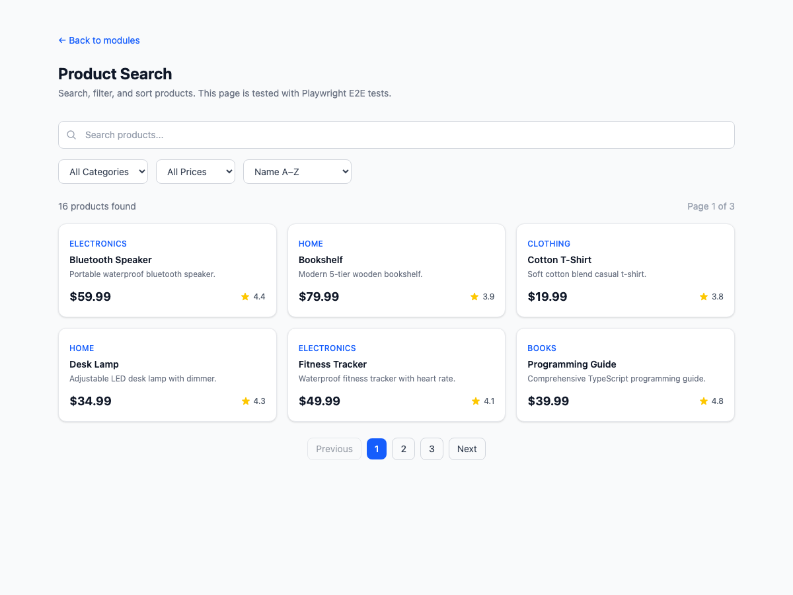
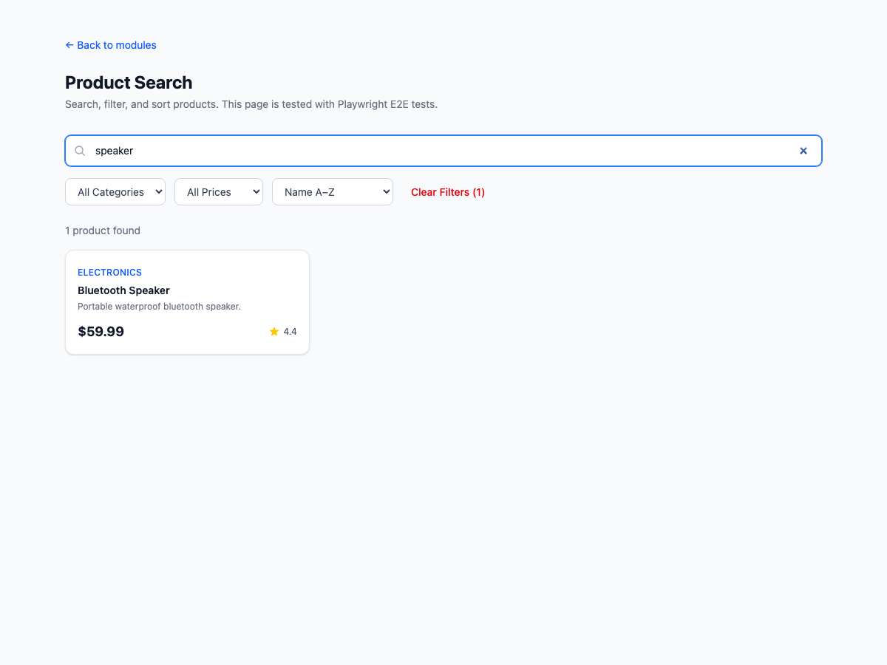
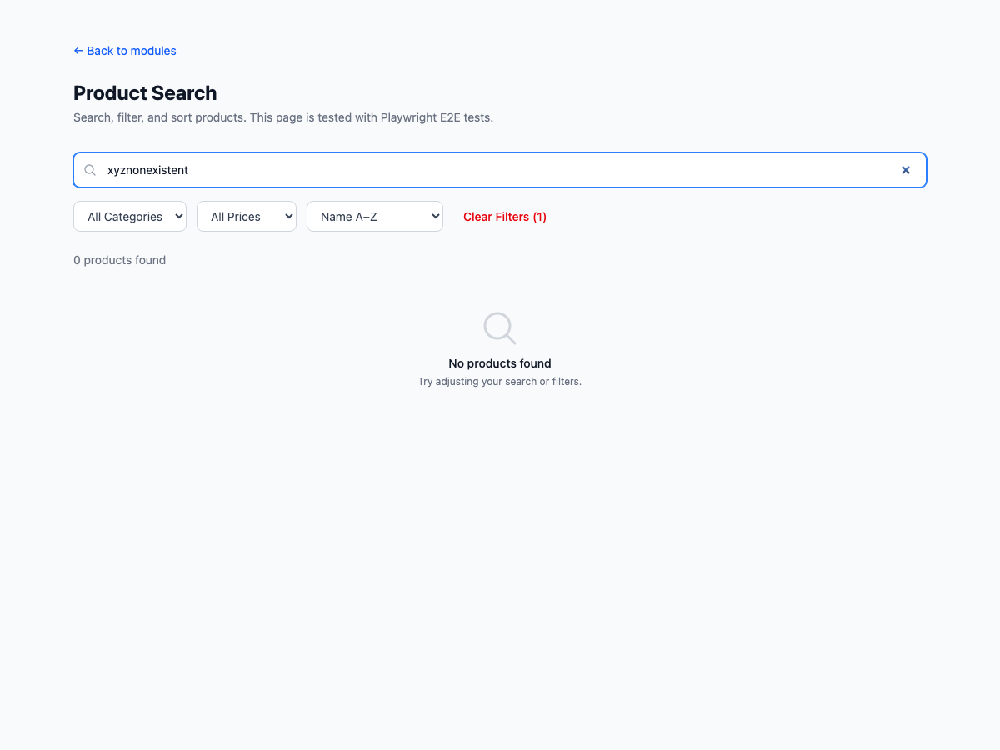
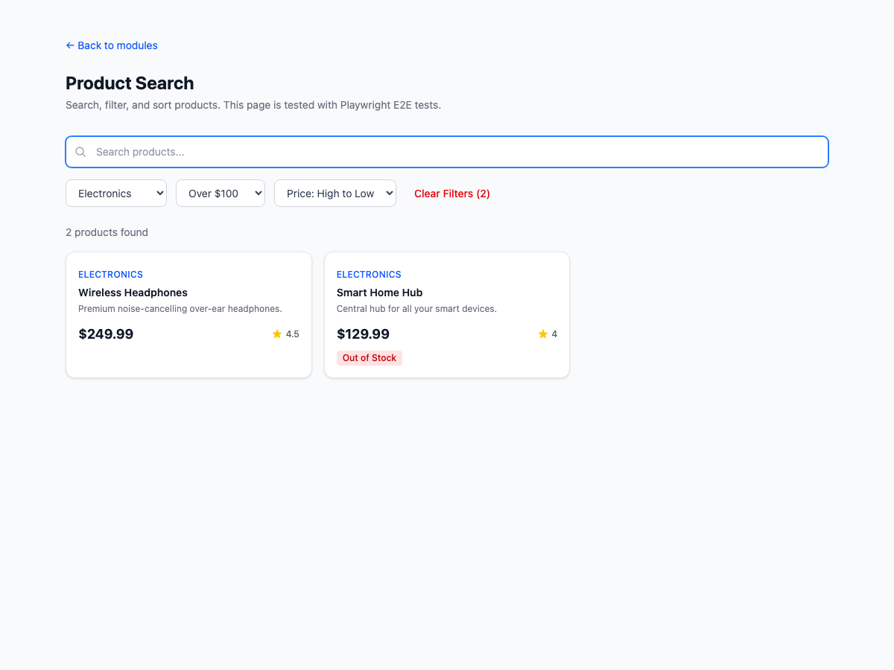
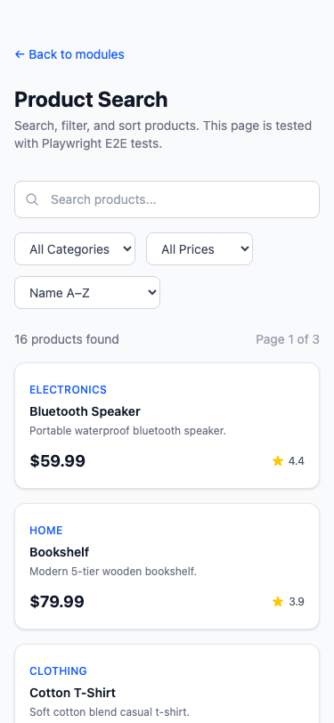

# Exercise 5: Write Tests for Product Search

## Overview

A product search page with text search, category/price filtering, sorting, and pagination — plus a comprehensive Playwright E2E test suite with 26 tests covering all interactions. Built with React 19 + TypeScript + Tailwind CSS v4.

## Setup Instructions

```bash
npm install
npm run dev

# Run the tests
npx playwright test tests/product-search.spec.ts

# View test report
npx playwright show-report
```

Navigate to: `http://localhost:5173/module-3/exercise-5`

## What Was Implemented

### Product Search Page (Testable UI)

| File | Description |
|------|-------------|
| `src/modules/module-3/exercise-5/types/product.ts` | `Product`, `SortOption`, `CategoryFilter`, `PriceRange` types |
| `src/modules/module-3/exercise-5/lib/data.ts` | 16 products across 5 categories, pagination config |
| `src/modules/module-3/exercise-5/components/features/ProductSearch.tsx` | Full search page: input, filters, sort, grid, pagination, empty state |
| `src/pages/Module3Exercise5.tsx` | Demo page wrapper |

### Playwright Test Suite

**File:** `tests/product-search.spec.ts` — **26 tests, all passing**

| Test Group | Tests | What's Tested |
|------------|-------|---------------|
| **Search Input** | 5 | Valid query, case-insensitive, description match, no results (empty state) |
| **Category Filter** | 3 | Electronics (5), Books (2), category change resets pagination |
| **Price Range Filter** | 3 | Under $25 (3), over $100 (4), combined category+price filter |
| **Sort** | 4 | Name A-Z/Z-A, price low/high, top rated |
| **Pagination** | 6 | 3 pages visible, page 2 nav, last page (4 items), prev/next disabled states |
| **Clear Filters** | 3 | Button appears when active, resets all, shows active count |
| **Responsive** | 2 | Mobile single-column, desktop 3-column grid |

### Test Results

```
Running 26 tests using 5 workers
  26 passed (6.2s)
```

### Playwright HTML Report

Run `npx playwright show-report` to open the interactive report.


## Screenshots

### Default View (16 products, paginated)


### Search Results (query: "speaker")


### Empty State (no results)


### Multiple Filters Applied (Electronics + Over $100 + Price desc)


### Mobile View


## AI Prompts Used

### Prompt 1: Product Search Page

```
Create a searchable product listing page with text search input, category
dropdown filter, price range filter, sort dropdown (name, price, rating),
and pagination (6 items per page). Include an empty state for no results.
Use TypeScript, Tailwind CSS with dark mode, and add data-testid and
aria-label attributes for Playwright test targeting.
```

### Prompt 2: E2E Tests for Search

```
Create Playwright E2E tests for a product search feature. Test search input
with valid query, case-insensitive search, description matching, and empty
results. Assert result counts using a data-testid="results-count" element.
```

### Prompt 3: Filter and Sort Tests

```
Write Playwright tests for category filtering (by Electronics, Books),
price range filtering (under $25, over $100), and combined filters. Also
test all sort options (name A-Z, Z-A, price asc/desc, top rated) by
checking the first product card after sorting.
```

### Prompt 4: Pagination Tests

```
Create Playwright tests for pagination: verify 3 pages exist for 16 items
at 6 per page, navigate to page 2 and 3, verify item counts on each page,
test Previous/Next button disabled states on first/last pages, and confirm
aria-current="page" on the active page button.
```

### Prompt 5: Clear Filters and Responsive Tests

```
Write tests for the Clear Filters button: verify it appears only when
filters are active, shows the count of active filters, and resets all
inputs to defaults. Add responsive tests checking single-column grid at
375px and 3-column grid at 1400px using evaluate on gridTemplateColumns.
```

## Acceptance Criteria Checklist

- [x] Search with valid query — filters products by name
- [x] Search with no results — empty state displayed
- [x] Apply single filter — category or price range
- [x] Apply multiple filters — category + price combined
- [x] Clear all filters — resets to 16 products
- [x] Pagination navigation — pages 1/2/3, prev/next
- [x] Sort by different criteria — name, price, rating
- [x] All 26 tests pass in headless mode
- [x] Tests work across mobile and desktop viewports
- [x] Proper assertions for each scenario
- [x] Error/empty state handling tested
