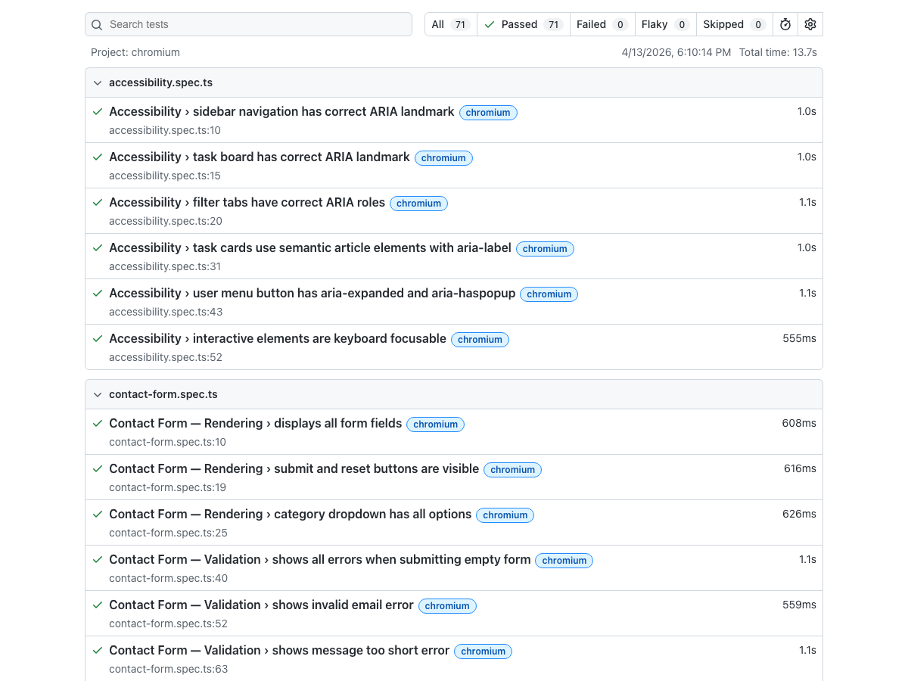
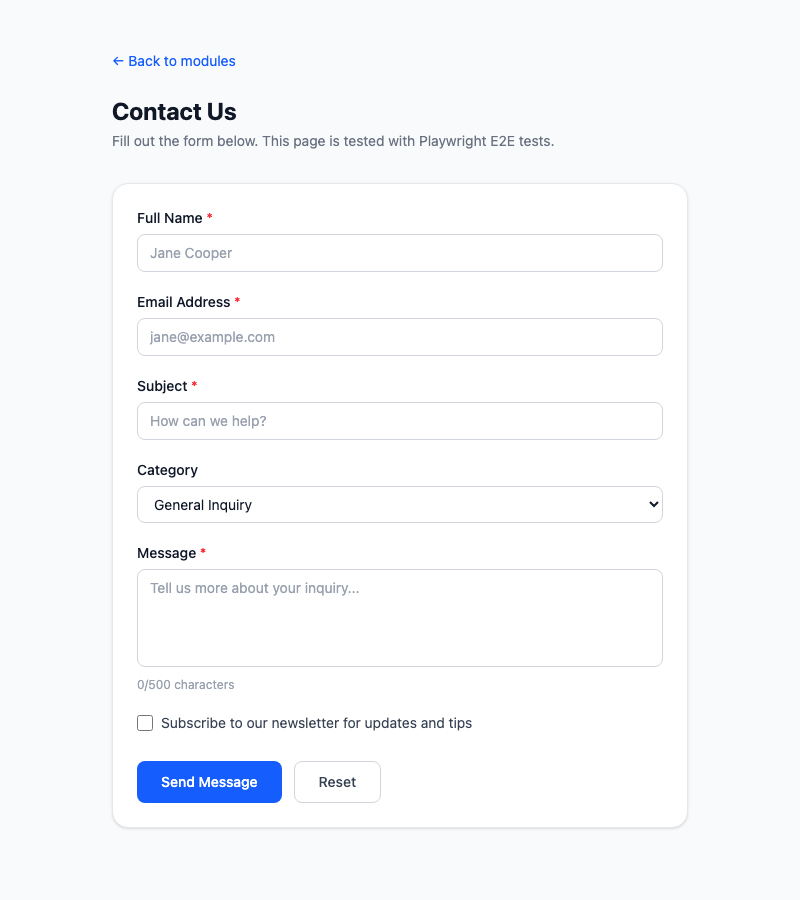
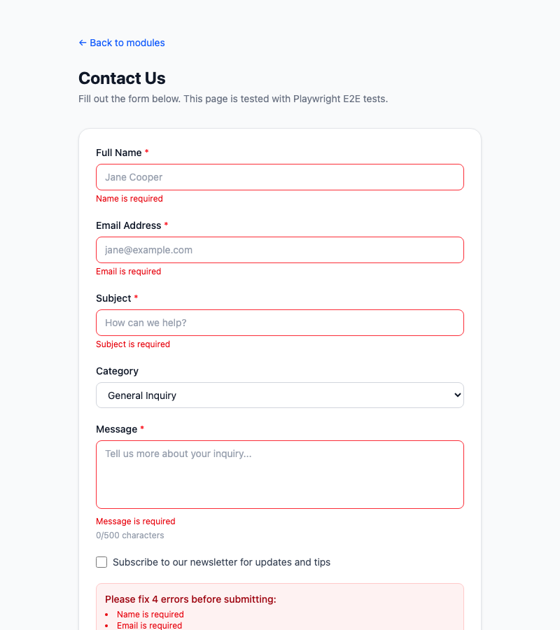
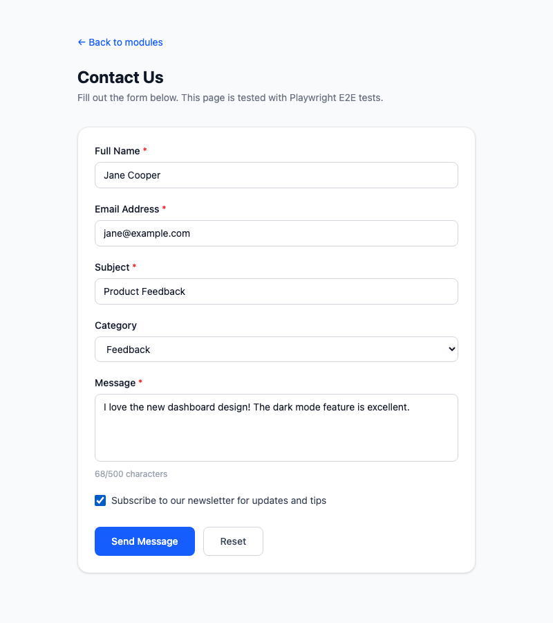
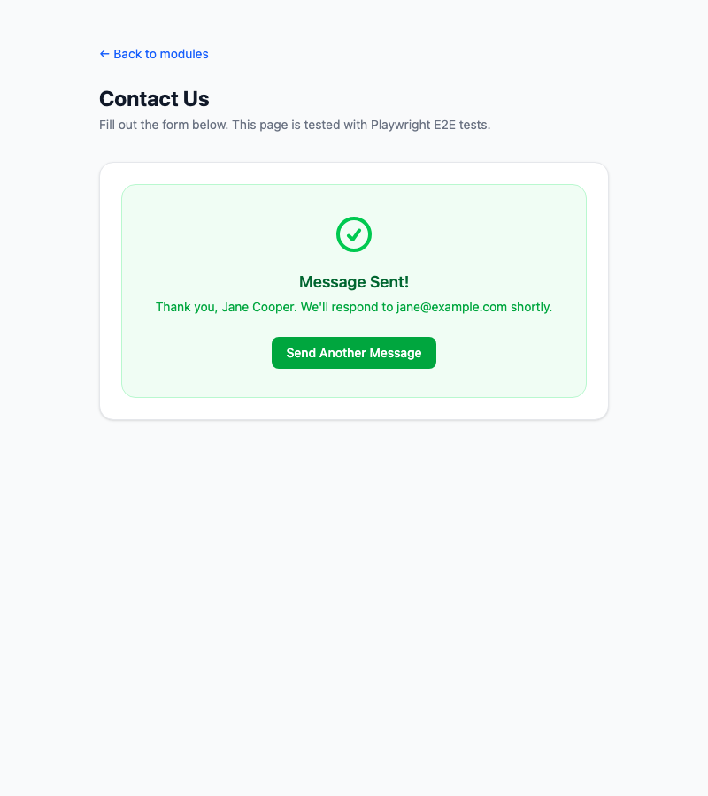
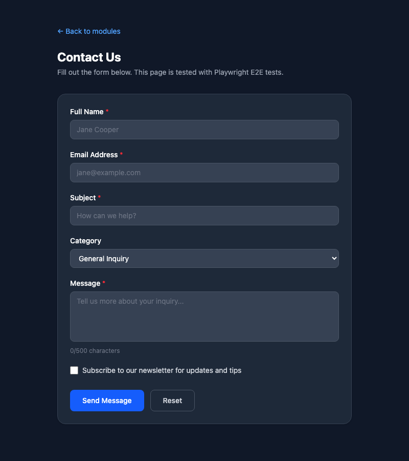

# Exercise 6: Write Tests for Contact Form

## Overview

A contact form with client-side validation (required fields, email format, minimum length), error display, success state, and reset — plus a comprehensive Playwright E2E test suite with 15 tests. Built with React 19 + TypeScript + Tailwind CSS v4 with dark mode.

## Setup Instructions

```bash
npm install
npm run dev

# Run the tests
npx playwright test tests/contact-form.spec.ts

# View test report
npx playwright show-report
```

Navigate to: `http://localhost:5173/module-3/exercise-6`

## What Was Implemented

### Contact Form Page

| File | Description |
|------|-------------|
| `src/modules/module-3/exercise-6/types/form.ts` | `ContactFormData`, `FieldError` interfaces |
| `src/modules/module-3/exercise-6/components/features/ContactForm.tsx` | Full form: name, email, subject, category, message, subscribe checkbox, validation, success state |
| `src/pages/Module3Exercise6.tsx` | Demo page wrapper |

### Form Features

- **4 required fields**: Name, email, subject, message — with inline error messages
- **Email validation**: Regex pattern check for valid email format
- **Minimum length**: Message must be at least 10 characters
- **Category dropdown**: General / Support / Billing / Feedback
- **Newsletter checkbox**: Optional subscribe toggle
- **Character counter**: Live count for message field (0/500)
- **Error summary**: Red box listing all errors with count
- **Accessibility**: `aria-invalid`, `aria-describedby`, `role="alert"` on errors
- **Loading state**: "Sending..." button text during simulated submission
- **Success state**: Green confirmation with user name/email, "Send Another" button
- **Reset button**: Clears all fields and validation errors
- **Dark mode**: Full `dark:` variant support

### Playwright Test Suite

**File:** `tests/contact-form.spec.ts` — **15 tests, all passing**

| Test Group | Tests | What's Tested |
|------------|-------|---------------|
| **Rendering** | 3 | All fields visible, buttons present, category options |
| **Validation** | 5 | Empty form (4 errors), invalid email, short message, aria-invalid, error clearing on type |
| **Successful Submission** | 3 | Valid submit + success message, send another, category + checkbox |
| **Reset** | 2 | Reset clears fields, reset clears errors |
| **Character Counter** | 1 | Live character count updates |
| **Responsive** | 1 | Mobile form renders and validates |

### Test Results

```
Running 15 tests using 5 workers
  15 passed (4.2s)
```

### Full Suite (All Exercises)

```
Running 71 tests using 5 workers
  71 passed (13.4s)
```

### Playwright HTML Report

Run `npx playwright show-report` to open the interactive report.



## Screenshots

### Empty Form


### Validation Errors (empty submit)


### Filled Form


### Success State


### Dark Mode


## AI Prompts Used

### Prompt 1: Contact Form with Validation

```
Create a contact form component with fields for name, email, subject, category
dropdown, message textarea, and newsletter checkbox. Include client-side
validation: required fields, email format regex, minimum message length (10 chars).
Show inline errors with aria-invalid and role="alert". Add an error summary box
and character counter. Use TypeScript and Tailwind CSS with dark mode support.
```

### Prompt 2: Form Submission and Success State

```
Add form submission handling with a simulated async delay (800ms). Show a
"Sending..." loading state on the submit button. After success, replace the
form with a green confirmation message showing the user's name and email, plus
a "Send Another Message" button that resets the form. Use data-testid attributes
for Playwright test targeting.
```

### Prompt 3: E2E Tests for Validation

```
Write Playwright E2E tests for form validation. Test submitting an empty form
(should show 4 errors), submitting with an invalid email, submitting with a
message under 10 characters, checking aria-invalid attributes on invalid fields,
and verifying errors clear when the user starts typing in a field.
```

### Prompt 4: E2E Tests for Submission and Reset

```
Write Playwright tests for successful form submission: fill all fields with
valid data, click submit, verify loading state shows "Sending...", then verify
success message appears with the user's name and email. Test the "Send Another"
button resets to an empty form. Test the reset button clears all fields and
removes any validation errors.
```

### Prompt 5: Character Counter and Responsive Tests

```
Add a test verifying the message character counter updates from "0/500" to
"11/500" after typing "Hello World". Add a mobile viewport test (375px) that
confirms the form renders correctly and validation still works on small screens.
```

## Acceptance Criteria Checklist

- [x] Form displays all required fields with labels
- [x] Client-side validation for required fields, email format, message length
- [x] Inline error messages with proper ARIA attributes
- [x] Error summary box with total error count
- [x] Loading state during submission
- [x] Success state with user details after submit
- [x] Reset functionality clears all fields and errors
- [x] All 15 tests pass in headless mode
- [x] Tests work on mobile viewport
- [x] Error handling for all validation scenarios tested
- [x] Dark mode support on all form elements
