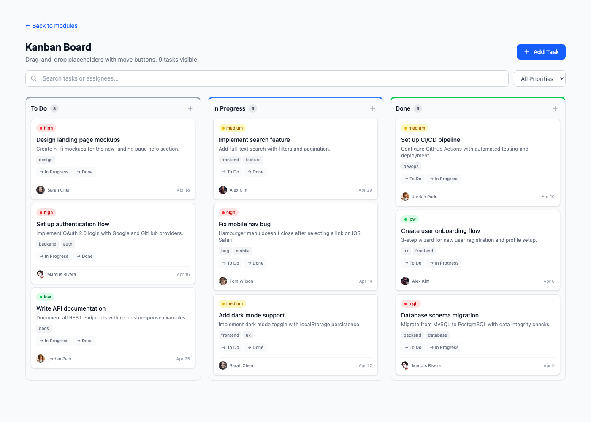
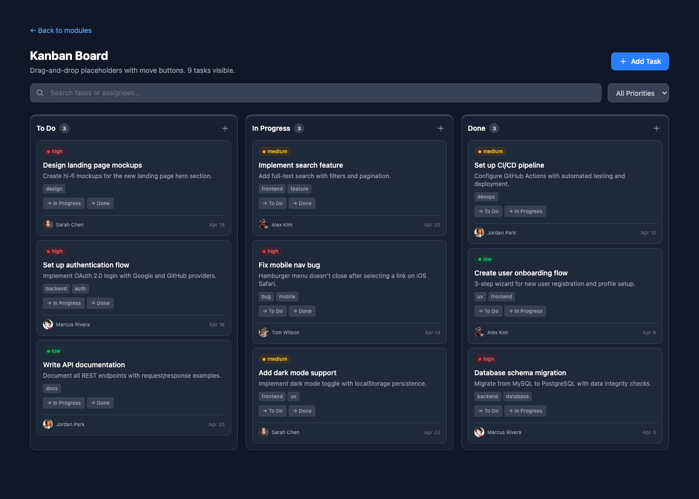
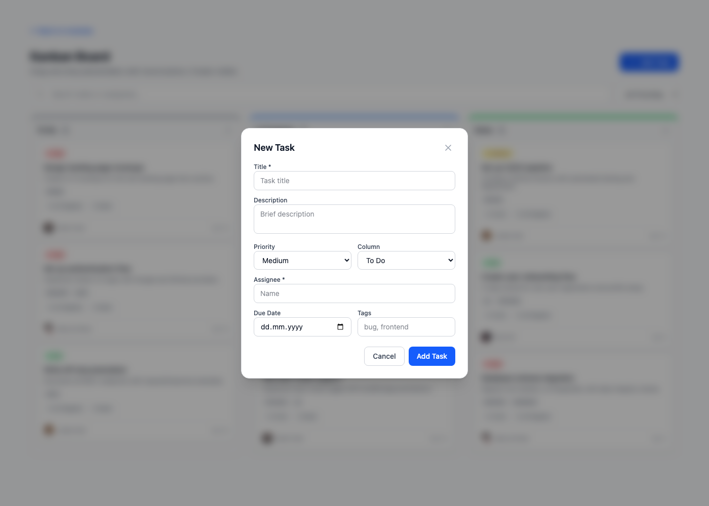
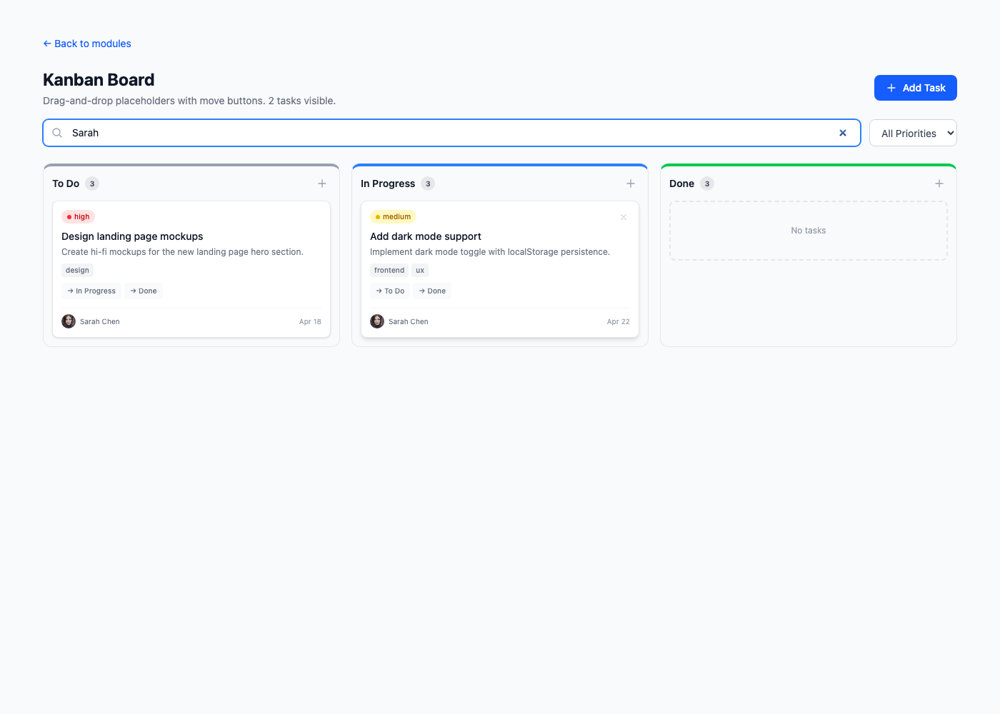
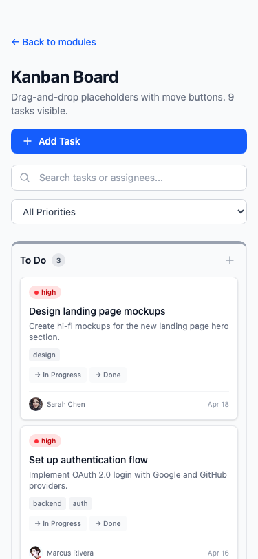

# Exercise 7: Build a Project Management Board

## Overview

A Kanban-style project management board with three columns (To Do, In Progress, Done), task cards with metadata, move-between-columns buttons (drag-and-drop placeholder), add task modal, search and priority filtering. Built with React 19 + TypeScript + Tailwind CSS v4 with dark mode.

## Setup Instructions

```bash
npm install
npm run dev
# Navigate to http://localhost:5173/module-4/exercise-7
```

## What Was Implemented

### Components Created

| File | Description |
|------|-------------|
| `types/kanban.ts` | `KanbanTask`, `Column`, `ColumnId`, `TaskPriority`, `NewTaskData` |
| `lib/data.ts` | 9 sample tasks across 3 columns, column definitions |
| `hooks/useKanbanBoard.ts` | Board state: tasks, search, priority filter, move/add/delete, column counts |
| `components/ui/TaskCard.tsx` | Task card: priority dot, title, description, tags, move buttons, assignee, date |
| `components/ui/BoardColumn.tsx` | Column container: header with count badge, task list, add button, empty state |
| `components/ui/AddTaskModal.tsx` | Modal form: title, description, priority, column, assignee, date, tags |
| `components/features/KanbanBoard.tsx` | Main board: header, search/filter bar, 3-column grid, modal integration |
| `components/features/index.ts` | Barrel export |

### Key Features

- **3 Board Columns**: To Do (gray), In Progress (blue), Done (green) with colored top borders and task counts
- **Task Cards**: Priority dot + badge (red/yellow/green), title, description (2-line clamp), tags, assignee avatar, due date
- **Move Between Columns**: "→ In Progress" / "→ Done" buttons on each card (drag-and-drop placeholder)
- **Add Task Modal**: Full form with title, description, priority select, column select, assignee, date, tags — opens per-column or via header button
- **Search**: Filters by task title and assignee name in real-time
- **Priority Filter**: Dropdown to show only high/medium/low tasks
- **Delete Task**: X button (appears on hover) to remove tasks
- **Task Counts**: Real-time counts in column headers (not affected by filters)
- **Empty State**: Dashed border placeholder when column has no matching tasks
- **Dark Mode**: Full `dark:` variant support on all components
- **Responsive**: Columns stack vertically on mobile, 3-column grid on desktop

### State Management

- `useKanbanBoard` hook manages all board state:
  - `tasks` array with `useState`
  - `searchQuery` and `priorityFilter` for filtering
  - `useMemo` for `filteredTasks` and `totalByColumn`
  - `useCallback` for `moveTask`, `addTask`, `deleteTask`
- Column counts show total (unfiltered) while card grid shows filtered results

## Screenshots

### Board — Light Mode


### Board — Dark Mode


### Add Task Modal


### Search Filter (showing Sarah's tasks)


### Mobile View


## AI Prompts Used

### Prompt 1: Kanban Board Layout

```
Create a Kanban board component with columns for Todo, In Progress, and Done.
Include task cards with assignees, due dates, and priority labels. Add placeholders
for drag-and-drop functionality. Use TypeScript and Tailwind CSS with dark mode support.
```

### Prompt 2: Task Card with Move Buttons

```
Create a TaskCard component that shows priority badge with colored dot, title,
description (line-clamp-2), tags, assignee avatar, and due date. Since we can't
use a drag-and-drop library, add small "→ In Progress" and "→ Done" move buttons
on each card that call a moveTask function. Include a delete X button that
appears on hover.
```

### Prompt 3: Board State Hook

```
Create a useKanbanBoard hook managing an array of KanbanTask objects. Include
search filtering (by title and assignee), priority filtering, moveTask (changes
a task's columnId), addTask (appends a new task), deleteTask (removes by id),
and column task counts using useMemo. Use useCallback for all mutators.
```

### Prompt 4: Add Task Modal

```
Build an AddTaskModal component with a backdrop overlay and centered dialog.
Include form fields: title (required), description, priority select, column
select, assignee (required), due date, and comma-separated tags. On submit,
call onAdd with the NewTaskData and close the modal. Support dark mode.
```

### Prompt 5: Board Column Component

```
Create a BoardColumn component with a colored top border (gray for Todo, blue
for In Progress, green for Done), header with column title and task count badge,
an add-task (+) button, scrollable task list area, and a dashed empty state
when no tasks match the current filters.
```

## Acceptance Criteria Checklist

- [x] Multiple board columns (To Do, In Progress, Done) with colored headers
- [x] Task cards with priority, title, description, tags, assignee, date
- [x] Move tasks between columns via buttons (drag-and-drop placeholder)
- [x] Add new task with modal form
- [x] Delete tasks
- [x] Search/filter tasks by name or assignee
- [x] Filter by priority level
- [x] Empty state for columns with no matching tasks
- [x] Dark mode support
- [x] Responsive layout (stacked on mobile, 3-column on desktop)
- [x] Proper TypeScript typing throughout
