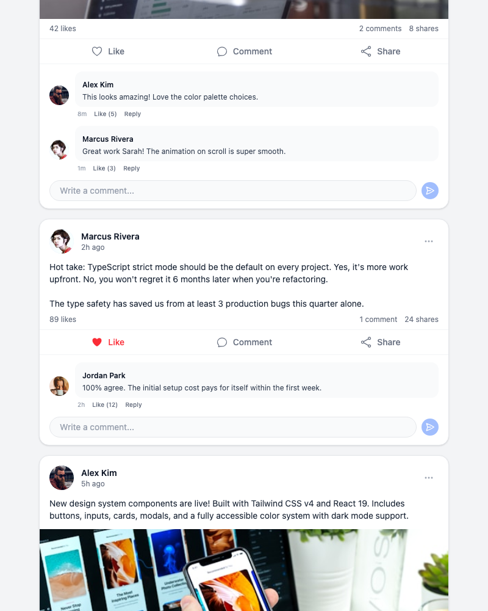
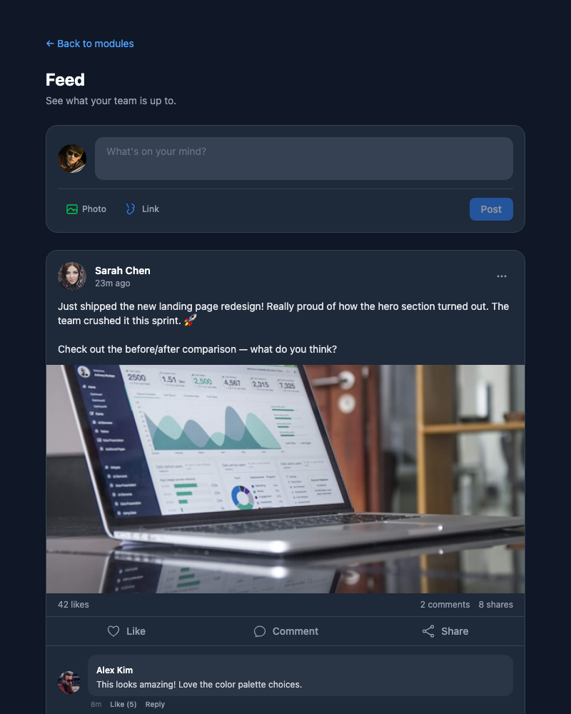
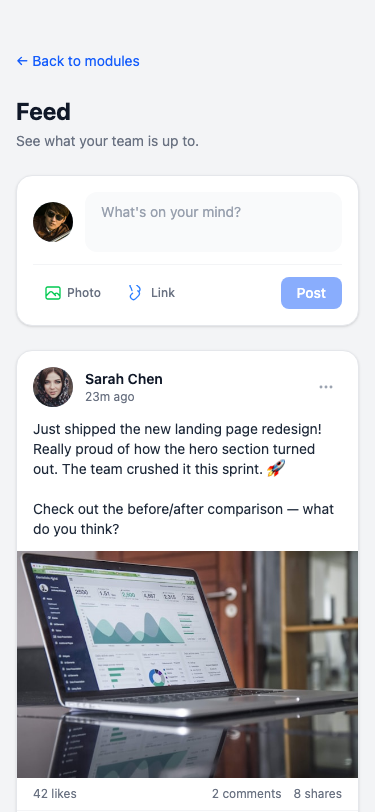

# Exercise 8: Create a Social Media Feed

## Overview

A social media feed with post creation, post cards (user info, content, images, engagement stats), like/unlike toggle, comment threads with expand/collapse, share counter, and infinite scroll placeholder. Built with React 19 + TypeScript + Tailwind CSS v4 with dark mode.

## Setup Instructions

```bash
npm install
npm run dev
# Navigate to http://localhost:5173/module-4/exercise-8
```

## What Was Implemented

### Components Created

| File | Description |
|------|-------------|
| `types/feed.ts` | `FeedUser`, `Comment`, `Post` interfaces |
| `lib/data.ts` | 5 sample posts with comments, 4 users, current user |
| `hooks/useFeed.ts` | Feed state: toggleLike, addComment, createPost, sharePost |
| `components/ui/UserAvatar.tsx` | Avatar with optional name/handle display, multiple sizes |
| `components/ui/PostCard.tsx` | Full post card: header, content, image, stats, action buttons, comments |
| `components/ui/CommentSection.tsx` | Comment list with expand/collapse, add comment input |
| `components/ui/CreatePost.tsx` | Post creation form: textarea, photo/link buttons, image URL input |
| `components/features/Feed.tsx` | Main feed: header, create post, post list, infinite scroll placeholder |
| `components/features/index.ts` | Barrel export |

### Key Features

- **Create Post**: Textarea with avatar, "Photo" button toggles image URL input, "Post" button adds to feed top
- **Post Cards**: User avatar + name + handle + time ago, multiline content with whitespace preservation, optional full-width image
- **Engagement Stats**: Like count, comment count, share count displayed between content and action buttons
- **Like/Unlike**: Heart button toggles filled/outline, like count increments/decrements, `aria-pressed` for accessibility
- **Comment Threads**: Shows first 2 comments, "View X more" expands all, each comment has avatar + bubble + Like/Reply buttons
- **Add Comment**: Rounded input with send arrow button at bottom of each post
- **Share**: Increments share count (placeholder functionality)
- **Infinite Scroll Placeholder**: Spinning loader at bottom of feed with "Loading more posts..." text
- **Dark Mode**: Full `dark:` variant support
- **Responsive**: Centered max-w-2xl layout, works on all screen sizes

### State Management

- `useFeed` hook manages the posts array with `useState`
- `toggleLike`: Maps over posts to flip `isLiked` and adjust count
- `addComment`: Creates new `Comment` object with current user and timestamp, appends to post's comments
- `createPost`: Prepends new `Post` to feed array
- `sharePost`: Increments share count
- All mutators use `useCallback` for stable references

## Screenshots

### Feed — Light Mode


### Comment Thread


### Feed — Dark Mode


### Liked Post (filled heart)


### Mobile View


## AI Prompts Used

### Prompt 1: Social Media Feed Layout

```
Create a social media feed component with post cards showing user info,
content, images, like/comment/share buttons, and comment threads. Include
infinite scroll placeholder and post creation form. Use modern design with
Tailwind CSS and dark mode support.
```

### Prompt 2: Post Card with Interactions

```
Build a PostCard component showing user avatar with name, handle, and time ago.
Display post content with whitespace-pre-line for line breaks, optional image,
engagement stats (likes, comments, shares), and three action buttons (Like with
heart icon that toggles filled/outline, Comment, Share). Use aria-pressed on
the like button for accessibility.
```

### Prompt 3: Comment Section

```
Create a CommentSection component that shows the first 2 comments with a
"View X more" expand button. Each comment shows an avatar, a rounded bubble
with name and text, and Like/Reply action links with timestamps. Include an
add comment input with a send arrow button at the bottom. Dark mode support.
```

### Prompt 4: Create Post Form

```
Build a CreatePost component with the current user's avatar, a textarea
placeholder "What's on your mind?", a Photo button that toggles an image URL
input, a Link button (placeholder), and a Post submit button. On submit, call
onPost with the content and optional image URL, then clear the form.
```

### Prompt 5: Feed State Hook

```
Create a useFeed hook that manages an array of Post objects. Include toggleLike
(flip isLiked and adjust count), addComment (create Comment with currentUser
and append), createPost (prepend new Post to array), and sharePost (increment
shares). All mutators should use useCallback for stable references.
```

## Acceptance Criteria Checklist

- [x] Post cards with user info, content, optional images
- [x] Like/unlike toggle with filled heart and count update
- [x] Comment threads with expand/collapse (first 2 visible)
- [x] Add comment input on each post
- [x] Share button with count increment
- [x] Create new posts with text and optional image
- [x] Infinite scroll placeholder (spinning loader)
- [x] Engagement stats (likes, comments, shares)
- [x] User avatars with initials fallback
- [x] Dark mode support on all components
- [x] Responsive layout (centered max-width)
- [x] Proper TypeScript typing throughout
